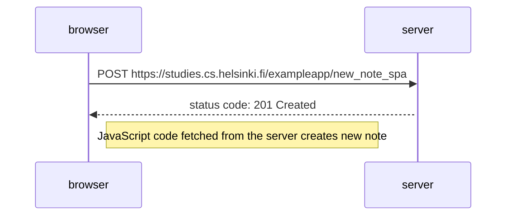

# Single-page App New Note Sequence Diagram

```mermaid
sequenceDiagram
    participant browser
    participant server

    browser->>server: POST https://studies.cs.helsinki.fi/exampleapp/new_note_spa
    activate server
    server-->>browser: status code: 201 Created

    Note right of browser: JavaScript code fetched from the server creates new note
```
